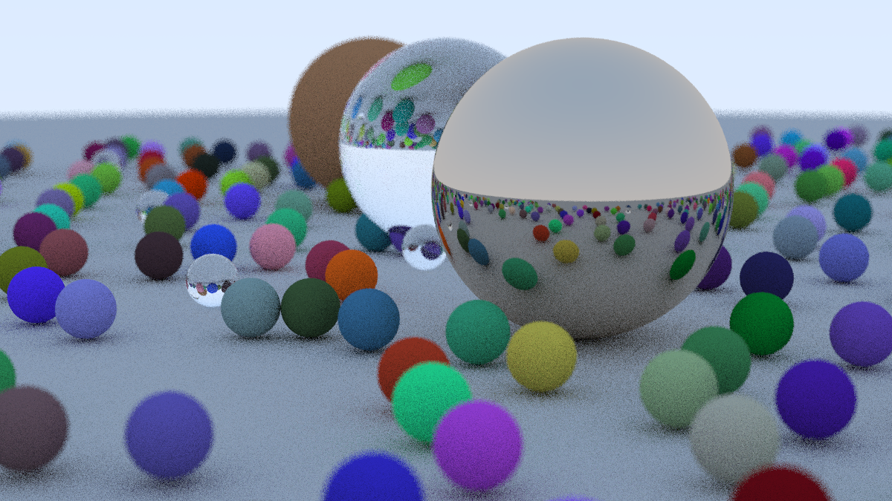

# pray - Python raytracer

"[Ray Tracing in One Weekend](https://raytracing.github.io/books/RayTracingInOneWeekend.html)" implemented in Python using only built-in libraries. As the saying goes: "no NumPy, no speed". Pray for patience, because this program requires a lot of it.

Final result:

<a href="https://brainmade.org/" lat="BrainMade mark.">
  <picture>
    <source media="(prefers-color-scheme: dark)" srcset="/docs/white-logo.svg">
    <source media="(prefers-color-scheme: light)" srcset="/docs/black-logo.svg">
    
  </picture>
</a>
